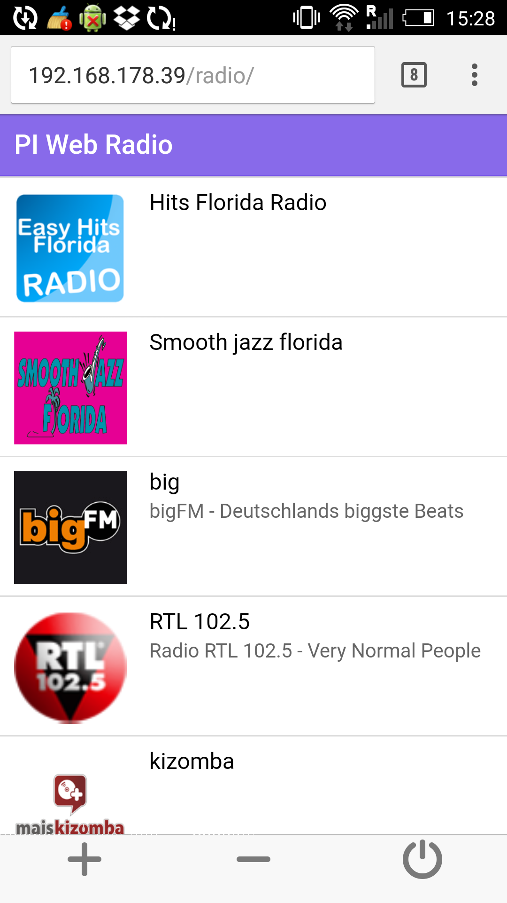

# PI Web Radio (under development)

This project aims at giving a nice interface to your raspberry pi radio.

<a href="assets/screenshot.png" target="_blank"></a>

# Prerequisites
* http://www.rougefm.com/favicon.ico
* Apache with PHP5 https://www.raspberrypi.org/documentation/remote-access/web-server/apache.md
* MPC / MPD https://learn.adafruit.com/raspberry-pi-radio-player-with-touchscreen/installing-the-music-player-daemon

Install

```shell
sudo ln -s ~/raspberrypi-webradio/bin/piradio /usr/local/bin/piradio
sudo chmod 755 /usr/local/bin/piradio
sudo ln -s ~/raspberrypi-webradio/web/ /var/www/radio
```

Other useful references
https://www.internet-radio.com/


